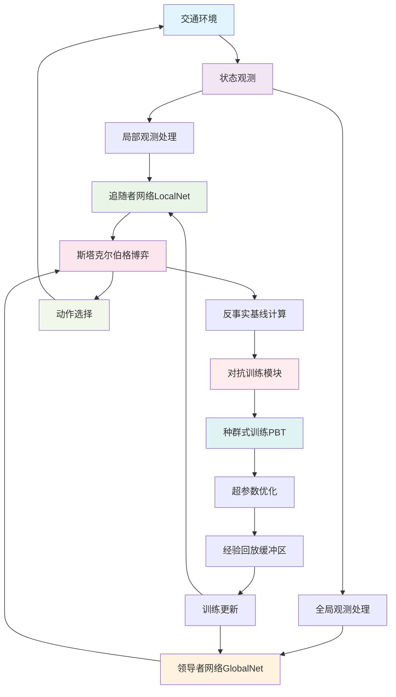
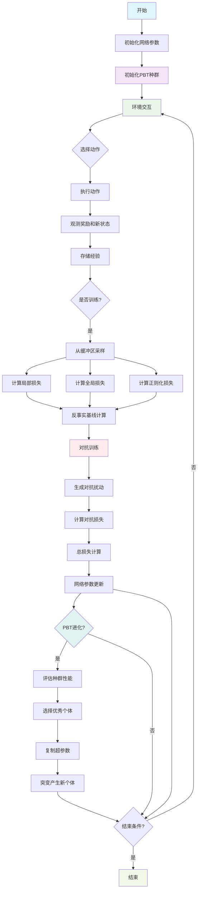
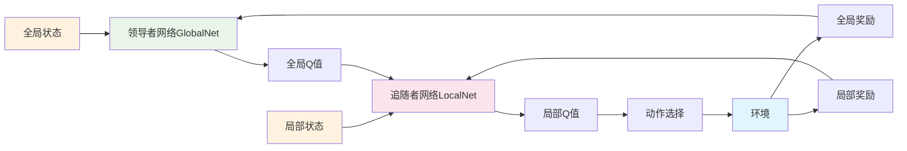
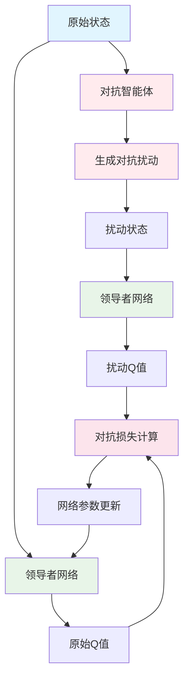

# 第三章 SPEAR 算法架构图

## 图3.1 SPEAR整体架构图



## 图3.2 SPEAR详细流程图



## 图3.3 斯塔克尔伯格博弈机制图



## 图3.4 对抗训练机制图



## 图3.5 种群式训练PBT流程图

```mermaid
graph TD
    A[初始化种群] --> B[评估个体性能]
    B --> C[排序选择]
    C --> D[优秀个体复制]
    D --> E[超参数突变]
    E --> F[热启动新个体]
    
    F --> G{是否收敛?}
    G -->|否| B
    G -->|是| H[输出最优个体]
    
    style A fill:#e1f5fe
    style B fill:#f3e5f5
    style C fill:#e8f5e8
    style D fill:#fff3e0
    style E fill:#fce4ec
    style H fill:#f1f8e9