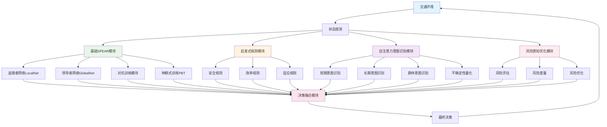
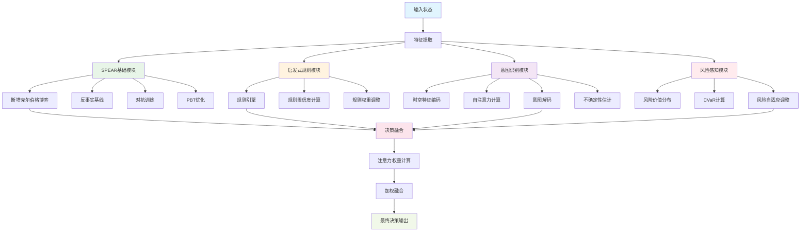
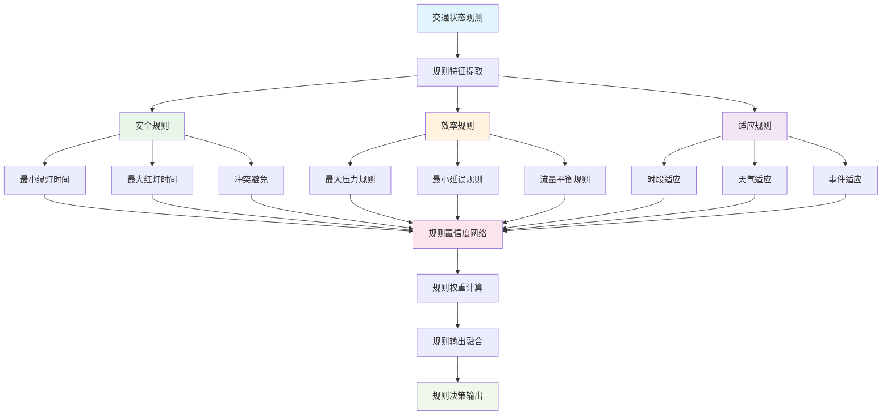
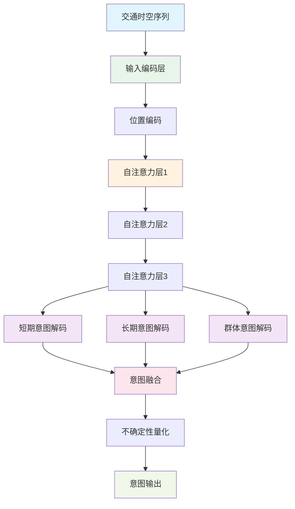
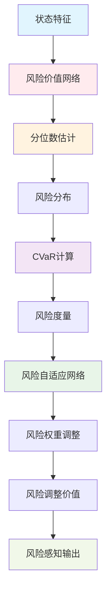
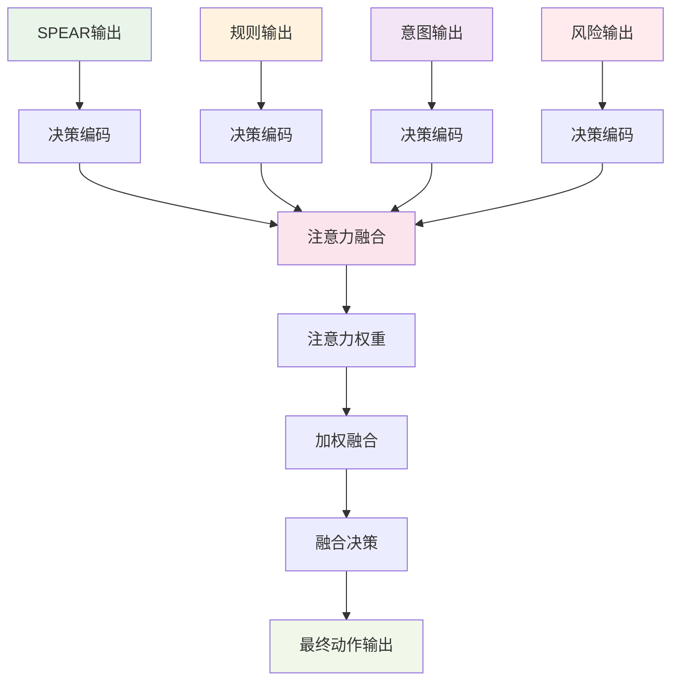

# 第四章 SPRER-PRO 算法架构图

## 图4.1 SPRER-PRO整体架构图



## 图4.2 SPRER-PRO详细模块图



## 图4.3 启发式规则模块详细图



## 图4.4 自注意力意图识别模块图



## 图4.5 风险感知优化模块图



## 图4.6 决策融合机制图



## 图4.7 SPRER-PRO训练流程图

```mermaid
graph TD
    A[初始化] --> B[各模块初始化]
    B --> C[数据预处理]
    
    C --> D[环境交互]
    D --> E[多模块并行处理]
    
    E --> F[SPEAR模块学习]
    E --> G[规则模块学习]
    E --> H[意图模块学习]
    E --> I[风险模块学习]
    
    F --> J[决策融合训练]
    G --> J
    H --> J
    I --> J
    
    J --> K[性能评估]
    K --> L{收敛判断}
    
    L -->|否| D
    L -->|是| M[模型保存]
    
    M --> N[部署应用]
    
    style A fill:#e1f5fe
    style B fill:#f3e5f5
    style D fill:#e8f5e8
    style E fill:#fff3e0
    style J fill:#fce4ec
    style M fill:#f1f8e9
    style N fill:#e0f2f1